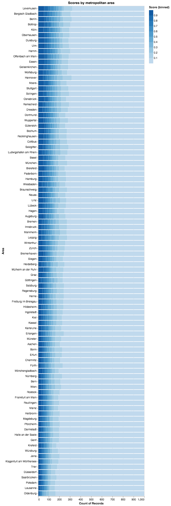

# Offensive Language in the German speaking Twittersphere

#### This is the first installment around the launch of [Hexis API](https://hexis.ai/en/index) and it is intended to show how &ndash; not hand-picked examples, but &ndash; real data looks through the lense of the classification system. We will use a few snippets of Python code to analyze the data and illustrate our findings.

#### About the data

The basis for this investigation is a sample of Twitter messages or _tweets_ collected during one day in the beginning of December. The sample consists of a thousand randomly selected tweets for each of the 93 metropolitan areas with more than 100.000 inhabitants across Germany, Austria, and Switzerland.

#### Loading the data

We assume `data.csv` to have the following format:

| tweet                                                                                                                                                                                                                                                                                      | near  | latitude   | longitude | 
|--------------------------------------------------------------------------------------------------------------------------------------------------------------------------------------------------------------------------------------------------------------------------------------------|-------|------------|-----------| 
| ...                                                                                                                                                                                                                                                                                        |       |            |           | 
| "Über Qualitätsjournalisten, Arsch und Grundeis Folge 2 URL …"                                                                                                                                                                                                                              | Herne | 51.5380394 | 7.219985  | 
| "So etwas lesen zu müssen, macht mich unendlich traurig. Ist #Deutschland wirklich wieder so weit dunkle Kapitel zu wiederholen?"                                                                                                                                                          | Herne | 51.5380394 | 7.219985  | 
| "Edi Glieder ein Schalke-Flop? Das ist eine bodenlose Frechheit!!!!!!!! URL …"                                                                                                                                                                                                             | Herne | 51.5380394 | 7.219985  | 
| "Kommt in deine KGB Akte, du Loser! Und Milli bleibt Genosse, wie $adam Hü$$€¥N oder MATERNUS PILS!!!"                                                                                                                                                                                     | Herne | 51.5380394 | 7.219985  | 
| "Guten Morgen verehrte TL ☕️"                                                                                                                                                                                                                                                              | Herne | 51.5380394 | 7.219985  | 
| "Sicher. Aber bis so etwas möglich ist  ... Hilfe, Aufarbeitung ist ein komplexer, vielschichtiger und langwieriger Prozess, der meist Psychotherapie benötigt. Oft dauert es Jahre. Kurze Empfehlungen gibt es da nicht sondern können irritieren, weil es auf das konkrete Kind ankommt" | Herne | 51.5380394 | 7.219985  | 
| "USER sind sie schon daaaa. Schon alles fertig Ganz nervös hier.😁😁😂🤪"                                                                                                                                                                                                                  | Herne | 51.5380394 | 7.219985  | 
| ...                                                                                                                                                                                                                                                                                        |       |            |           | 

<br>

In order to use this data we first want to load it into a spreadsheet-like data structure called dataframe.

    ```python
    import pandas as pd

    df = pd.read_csv('data.csv', header=0, engine='python')
    ```

#### Classification

Now that we have our data in place, it's time to get started with classification. This is a straightforward process: We will use the Hexis API endpoint ([documentation](https://hexis.ai/en/docs)) which expects a piece of JSON as input. The input should contain an element named `text`, the value of which is the tweet's text content. The endpoint will in turn respond with an _aggressiveness_-score for each text. You can get a score for up to 120-word long pieces of text. Of course it also makes sense to analyze longer text, just know that it will need to be split (or get split automatically by the API).

**Note:** If you don't have an API key yet, head over to [your account](https://hexis.ai/en/account/token) and create one for free.

    ```python
    import requests
    from time import sleep

    URL = 'https://api.hexis.ai/mod-1/de'
    API_KEY = 'your_api_key_here'

    for i, row in df.iterrows():
        # escape characters for JSON compliance
        text = row['tweet'].replace('"','\\"').replace('\n', ' ')
        
        # send to API
        header = {'Authorization': 'Bearer ' + API_KEY}
        data = {'text': text}
        response = requests.post(URL, json=data, headers=header)

        # process response
        score = response.json()['scores'][0]
        df.loc[i, 'score'] = score

        sleep(0.1)
    ```

The dataframe `df` should now look like this:

| tweet                                                                                                                                                                                                                                                                                      | near  | latitude   | longitude | score                 | 
|--------------------------------------------------------------------------------------------------------------------------------------------------------------------------------------------------------------------------------------------------------------------------------------------|-------|------------|-----------|-----------------------| 
| ...                                                                                                                                                                                                                                                                                        |       |            |           |                       | 
| "Über Qualitätsjournalisten, Arsch und Grundeis Folge 2 URL …"                                                                                                                                                                                                                              | Herne | 51.5380394 | 7.219985  | 0.9908769726753236    | 
| "So etwas lesen zu müssen, macht mich unendlich traurig. Ist #Deutschland wirklich wieder so weit dunkle Kapitel zu wiederholen?"                                                                                                                                                          | Herne | 51.5380394 | 7.219985  | 0.018021326512098312  | 
| "Edi Glieder ein Schalke-Flop? Das ist eine bodenlose Frechheit!!!!!!!! URL …"                                                                                                                                                                                                             | Herne | 51.5380394 | 7.219985  | 0.9930542111396791    | 
| "Kommt in deine KGB Akte, du Loser! Und Milli bleibt Genosse, wie $adam Hü$$€¥N oder MATERNUS PILS!!!"                                                                                                                                                                                     | Herne | 51.5380394 | 7.219985  | 0.9801527857780457    | 
| "Guten Morgen verehrte TL ☕️"                                                                                                                                                                                                                                                              | Herne | 51.5380394 | 7.219985  | 0.0029989404138177638 | 
| "Sicher. Aber bis so etwas möglich ist  ... Hilfe, Aufarbeitung ist ein komplexer, vielschichtiger und langwieriger Prozess, der meist Psychotherapie benötigt. Oft dauert es Jahre. Kurze Empfehlungen gibt es da nicht sondern können irritieren, weil es auf das konkrete Kind ankommt" | Herne | 51.5380394 | 7.219985  | 0.30031758546829224   | 
| "USER sind sie schon daaaa. Schon alles fertig Ganz nervös hier.😁😁😂🤪"                                                                                                                                                                                                                  | Herne | 51.5380394 | 7.219985  | 0.03731132298707962   | 
| ...                                                                                                                                                                                                                                                                                        |       |            |           |                       | 

#### Visualization

Next we will employ the visualization framework [Altair/Vega Lite](https://altair-viz.github.io) alongside freely available [TopoJSON](https://github.com/topojson/topojson-specification) files to produce a geographical mapping of our data.

    ```python
    import altair as alt

    TOPOJSON_URL = 'https://raw.githubusercontent.com/deldersveld/topojson/master/countries/germany/dach.json'
    map_data = df.groupby(['near']).mean()
    topo = alt.topo_feature(TOPOJSON_URL, feature='layer')
    
    background = alt.Chart(topo).mark_geoshape(
        fill='lightgray',
        fillOpacity=1.0,
        stroke='white',
        strokeWidth=1
    ).properties(
        width=500,
        height=500
    ).project('mercator')

    points = alt.Chart(map_data).mark_circle().encode(
        longitude='longitude:Q',
        latitude='latitude:Q',
        size=alt.Size('score:Q', title='score (mean)'),
        color='score:Q',
        tooltip=['near:N','score:Q']
    ).properties(title='Aggression in the German-speaking Twittersphere')

    plot = background + points
    plot.save('map.html')
    ```

This results in a nice interactive map in HTML format.

<p align="center"><iframe width="600" height="560" scrolling="no" src="dach_region_map.html"></iframe></p>

It's interesting to see the distribution of higher average scores across the historically more industrial areas. Nevertheless, averages don't give us the full picture. Let's use our data to produce a bar chart, displaying each metropolitan area and its individual scores, split into bins of 10% each.

    ```python
    df.columns = ['tweet', 'Area', 'latitude', 'longitude', 'Score']  # rename columns for plotting
    
    plot = alt.Chart(df).mark_bar().encode(
        x='count(Score)',
        y=alt.Y(
            'Area',
            sort=alt.EncodingSortField(
                field='Score',
                op='sum',
                order='descending')
            ), color=alt.Color(
                'Score:Q',
                bin=alt.Bin(maxbins=10))
    ).properties(title='Scores by metropolitan area')

    plot.save('barchart.html')
    ```

This produces a rather large but quite informative view on our data, making it possible to see an all-encompassing gradient of aggressiveness in our dataset. Roughly 4% of all tweets are problematic (corresponding to the top 90-100% range of scores) and should get looked at closely by human moderators in order to avoid any liabilities on part of the platform.



#### Wrapping up

We hope you enjoyed this small and ad hoc investigation into the underbelly of the German-speaking Twittersphere. As with any other empirical approach aiming to reach valid conclusions on a certain topic, data collection and curation continues to be the hardest part. However, if you already have the data, chances are that you can use the help of a powerful machine so that you, as an expert, only need to look at a fraction of the data. With a well tuned system, this only boils down to the borderline cases &ndash; in our opinion, this should be possible in no time. That's why we've created Hexis API.

Stay tuned for our next investigation.
