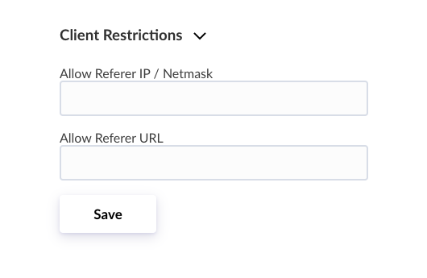
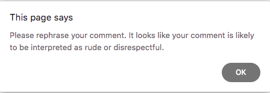

# How to safeguard Disqus comment sections

#### This post demonstrates how to integrate Hexis API with the Disqus discussion system. You can automatically detect harmful messages, block them, and provide authors with an error message &ndash; all in a matter of milliseconds.

[Disqus](https://disqus.com) is a widely used service for commenting on blogs and news sites, but also more generally, on static HTML sites, since it allows you to integrate a comment section very easily. Still, we want use something more powerful than its built-in toxicity filter. The following shows how to integrate with Hexis API and have it check on every new comment that is posted via Disqus.

**Note:** If you don't have an Hexis API key yet, head over to your account and [create one for free](https://hexis.ai/en/account/token). Also, you will need to [register for the Disqus API](https://disqus.com/api/applications/).

Our integration can be implemented using a callback as shown in the [Disqus documentation](https://help.disqus.com/en/articles/1717088-capture-disqus-commenting-activity-via-callbacks). Given the standard embed code

    ```javascript
    var disqus_shortname = '<example>';  // Required - Replace example with your forum shortname

    (function() {
      var dsq = document.createElement('script'); dsq.type = 'text/javascript'; dsq.async = true;
      dsq.src = '//' + disqus_shortname + '.disqus.com/embed.js';
      (document.getElementsByTagName('head')[0] || document.getElementsByTagName('body')[0]).appendChild(dsq);
    })();
    ```

it is possible to add a function that's triggered when a new comment is posted. All we need to do is wrap the Hexis API client code inside a `onNewComment` callback and add that to the standard embed code.

We can implement this on the client-side using only vanilla Javascript (no frameworks needed).

    ```javascript
    var disqus_config = function() {
      
      this.callbacks.onNewComment = [function(comment) {
        var HEXIS_URL = 'https://api.hexis.ai/mod-1/en';
        var HEXIS_KEY = 'Your Hexis API key';
        var THRESHOLD = 0.9;
        var DISQUS_URL = 'https://disqus.com/api/3.0/posts/remove.json';
        var DISQUS_KEY = 'Your Disqus API key';
        var STOP_MESSAGE = 'Please rephrase your comment. It looks like your comment is likely to be interpreted as rude or disrespectful.';
        var ERROR_MESSAGE = 'An error has occured. Please try again.';

        var data = JSON.stringify({'text': comment.text});
        var xhr = new XMLHttpRequest();
        xhr.open('POST', HEXIS_URL, true);
        xhr.setRequestHeader('Authorization', 'Bearer '+HEXIS_KEY);
        xhr.onload = function () {
          var res = JSON.parse(this.response);
          if (res.scores != null) {
            if (res.scores[0] > THRESHOLD) {
              alert(STOP_MESSAGE);
              
              var data2 = JSON.stringify({'api_key': DISQUS_KEY, 'post': comment.id});
              var xhr2 = new XMLHttpRequest();
              xhr2.open('POST', DISQUS_URL, true);
              xhr2.onload = function () {
                var res2 = JSON.parse(this.response);
                if (res2.code != 0) {
                  alert(ERROR_MESSAGE);
            }
          } else {
            alert(ERROR_MESSAGE);
          }
        };
        xhr.send(data);
      }];

    };
    ```

Enter your API keys at the beginning of this function as `HEXIS_KEY` and `DISQUS_KEY`.

The `THRESHOLD` value is set relatively high with `0.9`. This is because in the given example we will not be reviewing but instantly rejecting any message above this value, so we probably don't want it to be overly sensitive. Of course this value can be tuned depending on your use case. For more information see the [Hexis documentation](https://hexis.ai/en/docs#section/Using-the-API/Classification-Score).

Instead of discarding comments right away it is also possible to set `DISQUS_URL` to `https://disqus.com/api/3.0/posts/report.json`. This will flag comments and allow for their manual moderation.

This approach implies that the API keys appear in the source code of your website &ndash; which in itself is not a problem for smaller applications. However, API access must then be restricted using the _Client Restrictions_ on your [account page](https://hexis.ai/en/account/token) and only your web site must be allowed.



Enter the full URL address of the file (including `http://`) in the field _Allow Referrer URL_.

Test your input form protection and the following error message will appear.



Well done, no more harmful messages coming through your Disqus comments!

#### Better Security

Complementary to the integration shown above, it is possible to split functionality between the client and server-side. This has the upside of being able to hide connection details such as the API key and not only rely on referrer-based access control. If you're not running a web application yourself, the easiest way to accomplish this is via a small PHP script as discussed in another post on [how to safeguard any input form](../secure_static_websites).

The complete embed code for your HTML template:

    ```javascript
    <div id="disqus_thread"></div>
    <script>

        var disqus_config = function() {
          this.page.identifier = '{{ article.url }}';
          this.page.url = '{{ SITEURL }}/{{ article.url }}';
          this.callbacks.onNewComment = [function(comment) {
            var PHP_URL = 'api.php';
            var STOP_MESSAGE = 'Please rephrase your comment. It looks like your comment is likely to be interpreted as rude or disrespectful.';
            var data = new FormData();
            data.append('text', comment.text);
            data.append('id', comment.id);
            var xhr = new XMLHttpRequest();
            xhr.open('POST', PHP_URL, true);
            xhr.onload = function () {
              var res = JSON.parse(this.response);
              if (res.status == 1) {
                alert(STOP_MESSAGE);
              }
            };
            xhr.send(data);
          }];
        };
        
        (function() {
            var d = document, s = d.createElement('script');
            s.src = 'https://{{ DISQUS_SITENAME }}.disqus.com/embed.js';
            s.setAttribute('data-timestamp', +new Date());
            (d.head || d.body).appendChild(s);
        })();
    </script>
    <noscript>
        Please enable JavaScript to view the 
        <a href="https://disqus.com/?ref_noscript" rel="nofollow">
            comments powered by Disqus.
        </a>
    </noscript>
    ```

The complete `api.php` script:

    ```php
    <?php

    $HEXIS_KEY = '';
    $DISQUS_KEY = '';
    $DISQUS_TOKEN = '';
    $THRESHOLD = 0.9;

    function classify ($text) {
      global $HEXIS_KEY;
      $postData = json_encode(array('text' => $text));
      $ch = curl_init('https://api.hexis.ai/mod-1/en');
      curl_setopt($ch, CURLOPT_POSTFIELDS, $postData);
      curl_setopt($ch, CURLOPT_HTTPHEADER, array('Authorization: Bearer '.$HEXIS_KEY, 'Content-Length: '.strlen($postData)));
      curl_setopt($ch, CURLOPT_SSL_VERIFYHOST, 2);
      curl_setopt($ch, CURLOPT_RETURNTRANSFER, true);
      $response = curl_exec($ch);
      curl_close($ch);
      return $response;
    }

    function remove ($id) {
      global $DISQUS_KEY, $DISQUS_TOKEN;

      $getThreadDetails = 'https://disqus.com/api/3.0/posts/remove?api_secret='.$DISQUS_KEY.'&post='.$id.'&access_token='.$DISQUS_TOKEN;
      $threadDetailsSession = curl_init($getThreadDetails);
      curl_setopt($threadDetailsSession,CURLOPT_POST, true);
      curl_setopt($threadDetailsSession,CURLOPT_POSTFIELDS, '');
      curl_setopt($threadDetailsSession,CURLOPT_RETURNTRANSFER, true);
      $response = curl_exec($threadDetailsSession);
      curl_close($threadDetailsSession);
    }

    if ($_POST['text'] != '' and $_POST['id'] != '' and $_SERVER['HTTP_ACCEPT_LANGUAGE'] != '' and strpos($_SERVER['CONTENT_TYPE'], 'multipart/form-data') !== false) {
      $result = json_decode(classify($_POST['text']));
      if ($result->scores[0] >= $THRESHOLD) {
        remove($_POST['id']);
        echo json_encode(array('status' => 1));
      } else {
        echo json_encode(array('status' => 0));
      }
    }

    ?>
    ```