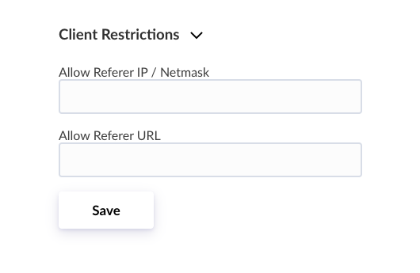
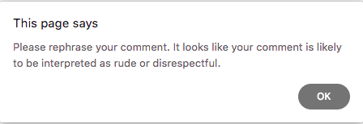

# How to safeguard any input form

#### In this post we will demonstrate how to can safeguard any contact form or other kind of input form on your website. The following approach works as a drop-in solution for static sites and on webhosts with limited features. The only prerequisite is that you have write access to the site's HTML code.

Not every website is based on a full-flegded blogging software, content management system or other kind of web application. In fact, many smaller websites and blogs are static sites that are manually crafted, sometimes with the help of site generators. Such sites are easily maintained and don't need any special features on the side of the webhost. Nevertheless, contact forms, comment functions or other interactive elements may be present here as well, which may need to be protected. **With the help of Hexis API, violating messages can be automatically detected, blocked, and an error message immediately displayed to the authors &ndash; all in real-time**.

This post includes two recipes showing how to integrate any website with Hexis API.

- **Recipe #1** is implemented on the client-side only using vanilla Javascript (no frameworks needed).
- **Recipe #2** extends that approach with a small PHP script for added security.

These solutions work for static websites as well as any type of site or web application in need of a quick fix to protect its input forms.

**Note:** If you don't have an Hexis API key yet, head over to your account and [create one for free](https://hexis.ai/en/account/token).

#### Recipe #1: Client-side only

Include the following script in the `head` of the HTML file:

    ```javascript
    <script>    
      window.onload = function(){
        var API_URL = 'https://api.hexis.ai/mod-1/en';
        var API_KEY = 'Your API key';
        var FIELD_ID = 'Your field ID';
        var FORM_ID = 'Your form ID';
        var THRESHOLD = 0.9;
        var STOP_MESSAGE = 'Please rephrase your comment. It looks like your comment is likely to be interpreted as rude or disrespectful.';
        var ERROR_MESSAGE = 'An error has occured. Please try again.';

        form = document.getElementById(FORM_ID)
        form.addEventListener('submit', event => {
          event.preventDefault();
          var data = JSON.stringify({'text': document.getElementById(FIELD_ID).value});
          var xhr = new XMLHttpRequest();
          xhr.open('POST', API_URL, true);
          xhr.setRequestHeader('Authorization', 'Bearer '+API_KEY);
          xhr.onload = function () {
            var res = JSON.parse(this.response);
            if (res.scores != null) {
              if (res.scores[0] > THRESHOLD) {
                alert(STOP_MESSAGE);
              } else {
                form.submit();
              }
            } else {
              alert(ERROR_MESSAGE);
            }
          };
          xhr.send(data);
        })
      }
    </script>
    ```

At the beginning of this function a few constants need to be defined.

- Enter your `API_KEY`.
- Change `FIELD_ID` to match the id of the actual `input` field that holds the text message.
- Change `FORM_ID` to match the id of the actual parent `form`.

That's all.

The `THRESHOLD` value is set relatively high with `0.9`. This is because in this example we will immediately reject any message above this value. Therefore we do not want the system to be overly sensitive. Of course this value can be set depending on your use case. For more information, please refer to the [Documentation] (https://hexis.ai/de/docs#section/Using-the-API/Classification-Score).

This way of exchanging information with the API implies that the API keys appear in the source code of your website &ndash; which in itself is not a problem for smaller use cases. However, API access must be restricted using the _Client Restrictions_ in your [Account Settings](https://hexis.ai/en/account/token) and only your website must be allowed.



Enter the full URL address of the file (including `http://`) in the field _Allow Referrer URL_ and you're set.

Test your input form protection using any kind of foul language and the following error message will appear.



Well done, no more harmful messages coming through your input form!

#### Recipe #2: Client and Server-side

The following code works as a drop-in solution on webhosts that support PHP. Most modern webservers support it by default. Why would we want to split functionality between a client and a server side? Everything that is executed on the client side needs to be public. For added security, we want to store the API key within a server-side script and also make the API request from there.

First, include this script in the `head` of the HTML file:

    ```javascript
    <script>
      window.onload = function(){
        var PHP_URL = 'api.php';
        var FIELD_ID = 'Your field ID';
        var FORM_ID = 'Your form ID';
        var THRESHOLD = 0.9;
        var STOP_MESSAGE = 'Please rephrase your comment. It looks like your comment is likely to be interpreted as rude or disrespectful.';
        var ERROR_MESSAGE = 'An error has occured. Please try again.';

        form = document.getElementById(FORM_ID)
        form.addEventListener('submit', event => {
          event.preventDefault();
          var data = new FormData();
          data.append('text', document.getElementById(FIELD_ID).value);
          var xhr = new XMLHttpRequest();
          xhr.open('POST', PHP_URL, true);
          xhr.onload = function () {
            var res = JSON.parse(this.response);
            if (res.status && res.score != null) {
              if (res.score > THRESHOLD) {
                alert(STOP_MESSAGE);
              } else {
                form.submit();
              }
            } else {
              alert(ERROR_MESSAGE);
            }
          };
          xhr.send(data);
        })
      }
    </script>
    ```

At the beginning of this function the following constants need to be defined.

- Change `FIELD_ID` to match the id of the actual `input` field that holds the text message.
- Change `FORM_ID` to match the id of the actual parent `form`.

That function basically performs the same remote call as in Recipe #1, but this time we `POST` to a PHP script instead of posting to the API directly.

Next, we create the file `api.php` containing the following code:

    ```php
    <?php

    // constants
    $API_URL = 'https://api.hexis.ai/mod-1/en/v1';
    $API_KEY = 'Your API key';
    $FORM_URL = 'https://your.domain/form.html';

    // submit to api
    function classify ($text) {
      global $API_URL, $API_KEY;
      $postData = json_encode(array('text' => $text));
      $ch = curl_init($API_URL);
      curl_setopt($ch, CURLOPT_POSTFIELDS, $postData);
      curl_setopt($ch, CURLOPT_HTTPHEADER, array('Authorization: Bearer '.$API_KEY, 'Content-Length: '.strlen($postData)));
      curl_setopt($ch, CURLOPT_SSL_VERIFYHOST, 2);
      curl_setopt($ch, CURLOPT_RETURNTRANSFER, true);
      $response = curl_exec($ch);
      curl_close($ch);
      return $response;
    }

    if ($_POST['text'] != '' and $_SERVER['HTTP_REFERER'] == $FORM_URL and $_SERVER['HTTP_ACCEPT_LANGUAGE'] != '' and strpos($_SERVER['CONTENT_TYPE'], 'multipart/form-data') !== false) {
      $result = json_decode(classify($_POST['text']));
      echo json_encode(array('status' => $result ? 1 : 0, 'score' => $result ? $result->scores[0] : 'An error has occured'));
    }

    ?>
    ```

Here the following constants need to be defined.

- Enter your `API_KEY`.
- Change `FORM_URL` to the full URL address of the HTML file (including `http://`).

Furthermore, the PHP script needs to be set executable in its file permissions (depending on your webhost &ndash; in a UNIX environment the permissions are `755`. On the command line: _chmod 755 api.php_).

#### Security Implications

Considering the security implications of our code snippets, the scenario we care about is this: How do we protect a public input form against abuse by automated clients?

Using a public API key together with other means of access control (as in Recipe #1) is perfectly viable. It should be noted however that `HTTP_REFERER` inside the request header can be forged, so in that case our security depends on the attacker not knowing about the referrer-based access restriction. This is not the most secure but the easiest measure to implement.

A better solution is to use a server-side script that performs the API request and whose source code isn't accessible by the client (as in Recipe #2). Security in that case depends on ensuring that _only_ our HTML file can `POST` to the PHP script. In order to do this, we want to ensure that the `POST` comes from a real web browser. Then we can leverage the fact that changing the `HTTP_REFERER` of an AJAX request is prevented by the browser. We have implemented this by checking the `HTTP_ACCEPT_LANGUAGE` and `CONTENT_TYPE` header values, but you can always try additional values or &ndash; better yet &ndash; combine this approach with a [CAPTCHA](https://en.wikipedia.org/wiki/CAPTCHA) that ensures only a human can submit the form.

_PS:_ The best approach in case you're using a web application framework and a database: You can treat protection against automated clients as a _rate-limiting_ problem. Just take note of all client IPs and impose a limit on how many times a client is allowed to make a request within a specific time frame.
